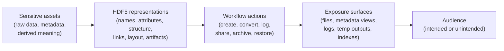

# HDF5 Privacy Exposure Model

This document defines a practical privacy model for the HDF5 ecosystem. It focuses on unintended disclosure, unnecessary retention, and cross-file inference risks that arise as HDF5 data moves through creation, processing, sharing, and archival workflows.

## Contents

- [1) Scope and security goals](#1-scope-and-security-goals)
- [2) HDF5 Privacy Exposure (H5PE) model in one page](#2-hdf5-privacy-exposure-h5pe-model-in-one-page)
- [3) Threat enumeration workflow](#3-threat-enumeration-workflow)
- [4) Practical examples](#4-practical-examples)
- [5) Exposure register template](#5-exposure-register-template)
- [6) Threat taxonomy aligned with HDF5 SSP SIG vulnerability categories](#6-threat-taxonomy-aligned-with-hdf5-ssp-sig-vulnerability-categories)
- [7) Checklists for reviewers](#7-checklists-for-reviewers)

## 1) Scope and security goals

The shared outline uses "security goals." In this document, that means the privacy and confidentiality properties that keep HDF5 content from being disclosed, over-retained, or made inferable beyond its intended audience.

### In scope

- HDF5 files and file collections
- datasets, groups, committed datatypes, attributes, references, and links
- structural metadata and layout characteristics that reveal meaning without reading the main payload
- logs, temporary files, exported metadata, test artifacts, and workflow byproducts
- plugins, wrappers, converters, and tools that change what metadata is stored or emitted

### Out of scope

- selecting a specific legal or regulatory regime
- assigning formal legal risk scores
- treating privacy as only an access-control or encryption technology problem outside the data lifecycle

### Working assumptions

1. HDF5 is self-describing, which makes metadata and structure first-class privacy surfaces.
2. Exposure is often accidental: publication, conversion, logging, backup, or archive behavior is enough.
3. Privacy risk changes over time as files are linked, aggregated, copied, or republished.
4. Tooling and extensions can add metadata or artifacts that users did not intend to disclose.
5. Partial protection of raw values does not automatically protect metadata, structure, or inference paths.

### Primary goals

- **Data minimization:** store and publish only the information needed for the intended use.
- **Confidentiality:** prevent unintended disclosure of sensitive values, metadata, and derived information.
- **Context integrity:** keep information within the audience, purpose, and lifecycle originally intended.
- **Linkability resistance:** reduce stable identifiers and cross-file join keys that enable re-identification.
- **Retention discipline:** avoid privacy loss from logs, temp files, backups, and archives that outlive their purpose.
- **Reviewability:** make privacy assumptions, residual exposure, and redaction decisions visible to reviewers.

## 2) HDF5 Privacy Exposure (H5PE) model in one page

For privacy work, the most useful unit is the exposure chain:

> **Trigger -> Exposure surface -> Disclosure**

Triggers are workflow actions. Exposure surfaces are places where sensitive information exists or can be inferred. Disclosure happens when that information becomes accessible to an unintended audience.



### What matters in practice

- **Sensitive assets:** raw measurements, identifiers, timestamps, locations, proprietary results, provenance, and combinations that become sensitive when correlated.
- **Representations:** dataset names, attribute values, compound field names, links, VDS mappings, layout choices, internal metadata, and serialized blobs embedded in attributes or datasets.
- **Workflow actions:** ingestion, conversion, debugging, publication, packaging, backup, restore, replication, and archive handoff.
- **Exposure surfaces:** the HDF5 file itself, sidecar outputs, CI artifacts, logs, temporary working directories, and metadata indexes built by tools.
- **Audience:** the intended reader is often not the only reader once a file is copied, mirrored, archived, or inspected with general-purpose tooling.

### The core privacy idea

A privacy issue is often not "the value was readable." It is that meaning was exposed through metadata, structure, correlation, or retained artifacts. That is why this model treats privacy findings as exposure chains rather than only access-control failures.

## 3) Threat enumeration workflow

Use this workflow for each file format profile, dataset family, pipeline, or release process.

### Step 0 - Set boundaries and privacy assumptions

Document:

- what information is considered sensitive in this context
- who the intended audience is at each lifecycle stage
- what workflows create, transform, publish, archive, or restore the data
- what tools, plugins, and wrappers can add or export metadata

### Step 1 - Inventory sensitive assets and HDF5 representations

List:

- raw data fields that may be sensitive
- metadata that carries meaning: names, attributes, units, timestamps, identifiers
- structural elements that reveal meaning: hierarchy, references, external links, VDS mappings, chunking or sparsity patterns
- side artifacts: logs, temp files, error traces, test fixtures, intermediate exports

### Step 2 - Map lifecycle stages and audiences

Track the stages where privacy can change:

- creation
- processing and conversion
- sharing and publication
- transfer and replication
- archive, backup, and restore

For each stage, identify both the intended audience and the likely unintended audience if the artifact is copied or exposed.

### Step 3 - Enumerate exposure surfaces

Describe privacy findings as exposure conditions, for example:

- identifiers are encoded in names or attributes
- structure reveals study design, participant count, or linkage paths
- logs or CI artifacts retain real data or metadata samples
- multiple files contain stable join keys that enable correlation

### Step 4 - Derive controls and review gates

Turn each exposure into concrete requirements:

- "Shared outputs shall not contain direct identifiers in object names or free-text attributes."
- "Release workflows shall scan for external links, serialized blobs, and unintended artifacts before publication."
- "Archive handoff shall record retention assumptions and a re-review owner."

Then define redaction, minimization, retention, packaging, and review controls.

### Step 5 - Attach evidence

Every meaningful exposure should map to evidence such as:

- metadata scanning output
- artifact inventory reviews
- test fixtures that verify redaction rules
- publication or archive checklists
- privacy notes that state residual exposure and assumptions

### Step 6 - Register and tag the result

Record each exposure in the register and tag it with one or more SSP categories from Section 6. The output should be:

- a privacy exposure list
- release or archive review gates
- redaction and retention rules
- verification evidence

## 4) Practical examples

### Example 1 - Identifiers embedded in names and attributes

**Scenario:** Dataset names and attributes include subject IDs, timestamps, device serials, or clinician initials.

- Trigger: file creation or export with descriptive metadata conventions
- Exposure surface: names, attributes, enum labels, compound field names
- Disclosure: sensitive identity or traceability information is visible to anyone who can inspect metadata
- Common tags: **PRV**, **OPS**
- Typical controls: naming rules, attribute allowlists, metadata scans, redaction before sharing

### Example 2 - Structure reveals sensitive meaning

**Scenario:** A file's hierarchy, references, VDS mappings, or layout patterns reveal participant count, study design, or links to sensitive sources.

- Trigger: use of expressive structure or external-link features
- Exposure surface: object graph, references, external links, layout metadata
- Disclosure: meaning is inferable even when raw values are not intended for publication
- Common tags: **PRV**, **FMT**
- Typical controls: structure review before release, link scanning, minimization of descriptive hierarchy, separate public and private products

### Example 3 - Tooling adds provenance or debug artifacts

**Scenario:** A converter, wrapper, or plugin writes usernames, file paths, hostnames, or sample values into metadata, logs, or temp outputs.

- Trigger: processing, conversion, debugging, or failed CI runs
- Exposure surface: generated attributes, logs, temporary directories, archived test outputs
- Disclosure: operational or personal information is exposed outside the intended context
- Common tags: **PRV**, **EXT**, **TCD**, **OPS**
- Typical controls: safe logging defaults, artifact review, plugin output validation, CI retention rules

### Example 4 - Correlation across files enables re-identification

**Scenario:** Individually acceptable releases become sensitive when stable keys, timestamps, masks, or location traces can be joined across files or public references.

- Trigger: publication, archive reuse, or multi-release analysis
- Exposure surface: join keys, repeated IDs, provenance, related file sets
- Disclosure: subjects, sites, or proprietary workflows become inferable through correlation
- Common tags: **PRV**, **OPS**, **UNK**
- Typical controls: correlation review, key rotation or suppression, archive re-review, explicit privacy notes on residual inference risk

## 5) Exposure register template

Use this template for entries in the privacy exposure register, including updates to [audit/registry/privacy-exposures.md](../audit/registry/privacy-exposures.md).

```markdown
## EXP-###: <short name>
- SSP category tags: <PRV|OPS|FMT|LIB|EXT|TCD|SCD|UNK>
- Exposure family: <see Section 6>
- Lifecycle stage:
- Sensitive asset:
- Trigger:
- Exposure surface:
- Disclosure:
- Unintended audience:
- Detection:
- Controls / mitigations:
  - Minimization:
  - Redaction:
  - Retention / packaging:
  - Review gate:
- Residual exposure / assumptions:
- Tests / evidence:
  - Metadata scan:
  - Artifact inventory:
  - Checklist or release note:
- Owner / status / milestone:
- Links:
```

## 6) Threat taxonomy aligned with HDF5 SSP SIG vulnerability categories

Use the exposure families below as the privacy vocabulary, then tag each finding with SSP categories so privacy work stays aligned with the safety and security registries.

### Exposure families

| Exposure ID | Exposure family | Description |
| --- | --- | --- |
| **P1** | Semantic metadata exposure | Sensitive meaning is encoded in names, attributes, labels, or other user-visible metadata. |
| **P2** | Structural or on-disk leakage | Hierarchy, references, layout, or internal metadata reveal information without reading the main payload. |
| **P3** | Raw-data pattern leakage | Data representation, headers, sparsity, or partially protected values reveal recognizable content. |
| **P4** | Unintended inclusion during processing | Converters, wrappers, plugins, or workflows add metadata, blobs, or side outputs that were not meant to travel downstream. |
| **P5** | Aggregation, correlation, or inference | Multiple files, releases, or auxiliary datasets combine to reveal sensitive information. |
| **P6** | Persistence beyond intended lifetime | Temp files, logs, backups, archives, and restored copies retain information longer or more broadly than intended. |
| **P7** | Misplaced trust in privacy by format | Users assume de-identification, partial encryption, or format boundaries provide privacy when they do not. |

### Alignment table

| SSP category | How it shows up in a privacy review | Exposure families most often involved |
| --- | --- | --- |
| **PRV** | metadata leakage, traceability, insufficient minimization, re-identification risk | P1, P2, P3, P4, P5, P6, P7 |
| **OPS** | oversharing, weak release review, unsafe retention, artifact sprawl, bad defaults | P4, P5, P6, P7 |
| **FMT** | references, links, VDS mappings, structural metadata, layout-derived leakage | P2, P5 |
| **LIB** | debug output, temporary files, metadata handling that exposes more than intended | P2, P6 |
| **EXT** | plugins or wrappers inject metadata, telemetry, or side artifacts | P4, P6 |
| **TCD** | converters, test tooling, dependency behavior, CI artifacts | P4, P6 |
| **SCD** | distribution or packaging changes privacy behavior or republishes unintended artifacts | P4, P6, P7 |
| **UNK** | novel exposure paths and emergent correlation risks | any |

## 7) Checklists for reviewers

### When a change touches naming, attributes, or schema design

- [ ] Could names, labels, enum values, or attributes encode direct identifiers or unnecessary free text?
- [ ] Are timestamps, locations, user IDs, hostnames, serials, or provenance values being added?
- [ ] Is there a naming or metadata rule that prevents sensitive meaning from becoming a default convention?
- [ ] Are metadata scans or redaction tests updated?

### When a change touches links, references, or file structure

- [ ] Could the hierarchy, external links, object references, or VDS mappings reveal sensitive relationships or source locations?
- [ ] Does the structure reveal counts, sparsity, cohort boundaries, or workflow logic that should stay private?
- [ ] Are public and private file products separated where needed?
- [ ] Are release scans checking for structural leak paths?

### When a change touches processing, conversion, or plugins

- [ ] Can tools add provenance, telemetry, file paths, or sample values to metadata or logs?
- [ ] Are temporary outputs and failed-job artifacts reviewed and retained safely?
- [ ] Are plugin or wrapper outputs validated against privacy expectations?
- [ ] Is the intended downstream audience still correct after conversion?

### When a change touches logging, testing, or CI artifacts

- [ ] Do logs or traces contain real data, metadata, paths, or identifiers?
- [ ] Are fixture files and archived artifacts using safe samples or reviewed real data?
- [ ] Are retention windows and access boundaries documented?
- [ ] Does debugging introduce a new exposure surface that should be gated or disabled by default?

### When a change touches sharing, publication, or archival workflows

- [ ] Is there a pre-release privacy review for the output package, not just the primary `.h5` file?
- [ ] Have correlation and re-identification risks been considered across related releases?
- [ ] Are privacy notes recorded with residual assumptions and intended audience?
- [ ] Is there an owner and re-review point for long-lived archives?
