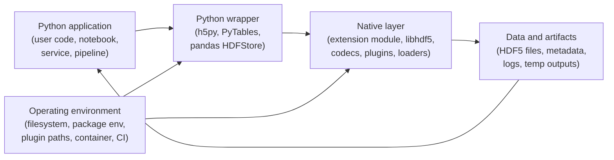

# HDF5 Python Wrapper Model

This document defines a practical safety, security, and privacy model for Python wrappers around native HDF5 libraries, with emphasis on `h5py`, `PyTables`, and PyTables-based consumers such as `pandas.HDFStore`.

It builds on the core models in [Safety Hazard.md](./Safety%20Hazard.md), [Security Threats.md](./Security%20Threats.md), and [Privacy Exposure.md](./Privacy%20Exposure.md). Those documents define the base hazard, attack, and exposure vocabulary for HDF5 itself. This document explains how the Python wrapper layer changes the trust boundary, expands the attack surface, and adds wrapper-specific review questions.

## Contents

- [1) Scope and SSP goals](#1-scope-and-ssp-goals)
- [2) HDF5 Python Wrapper (H5PW) model in one page](#2-hdf5-python-wrapper-h5pw-model-in-one-page)
- [3) Threat enumeration workflow](#3-threat-enumeration-workflow)
- [4) Practical examples](#4-practical-examples)
- [5) Wrapper review register template](#5-wrapper-review-register-template)
- [6) Threat taxonomy aligned with HDF5 SSP SIG vulnerability categories](#6-threat-taxonomy-aligned-with-hdf5-ssp-sig-vulnerability-categories)
- [7) Checklists for reviewers](#7-checklists-for-reviewers)

## 1) Scope and SSP goals

The purpose of this model is to help in analyzing the combined safety, security, and privacy properties that must hold when Python code drives native HDF5 parsing, storage, plugins, and object serialization paths. The model is designed to help reviewers identify and mitigate risks that arise from the Python-to-native transition, wrapper convenience features, and deployment patterns.

### In scope

- Python wrappers over native HDF5 libraries, especially `h5py` and `PyTables`
- CPython extension modules, Cython/CFFI glue, and vendored or dynamically linked native libraries
- wrapper-visible HDF5 features: datasets, groups, attributes, filters, VFDs, VOLs, links, references, and object-like storage patterns
- installation and runtime environments: wheels, package managers, shared libraries, plugin search paths, CI, notebooks, HPC jobs, and services
- privacy-relevant wrapper behavior such as logs, temp files, metadata generation, and object serialization

### Out of scope

- full API documentation for `h5py`, `PyTables`, or pandas
- proving wrapper correctness or native memory safety
- replacing the core HDF5 safety, security, or privacy models

### Working assumptions

1. The Python-to-native transition is an ABI boundary, not a security boundary.
2. A native parsing bug, plugin load, or unsafe deserialization path can compromise the entire Python process.
3. Python-level controls help, but process isolation is the strongest practical containment boundary.
4. Wrapper defaults, convenience features, and ecosystem patterns can turn "data handling" into code execution, corruption, or disclosure.
5. The wrapper risk profile depends on deployment context: notebook, desktop, HPC job, CI worker, batch pipeline, or service.

### Primary goals

- **Execution safety:** untrusted files, plugins, and serialized objects must not become implicit code execution paths.
- **Crash containment:** native faults and resource exhaustion should not take down more of the system than necessary.
- **Data integrity and correctness:** wrapper features should not hide corruption, stale state, or unsafe concurrency behavior.
- **Operational clarity:** users should understand what is trusted, what may be loaded dynamically, and what features cross security boundaries.
- **Privacy protection:** wrapper-generated metadata, logs, temp files, and object serialization should not leak sensitive information.
- **Supply chain integrity:** installed wheels, shared libraries, codecs, and plugins should be attributable and reviewable.

## 2) HDF5 Python Wrapper (H5PW) model in one page

Python wrappers add a layer of convenience, but they do not create a hard safety or security boundary. Once Python imports the wrapper, the trusted computing base expands to include the wrapper extension module, the HDF5 library, native dependencies, and any dynamically loaded plugins.



### What matters in practice

- **Application layer:** Python code decides what to open, trust, serialize, publish, and log.
- **Wrapper layer:** wrapper APIs can make dangerous native or serialization paths feel like ordinary Python operations.
- **Native layer:** `libhdf5`, codecs, plugins, and loaders are where many safety and execution risks actually live.
- **Data and artifacts:** HDF5 content may carry malformed structures, plugin-triggering metadata, pickled objects, sensitive names, or retained artifacts.
- **Operating environment:** wheels, shared library search paths, plugin directories, environment variables, and package provenance often decide whether the wrapper behaves safely.

### The core wrapper idea

For Python wrappers, the combined issue chain is usually:

> **Trigger -> Boundary crossing -> SSP outcome**

Common boundary crossings are:

- Python opens a file that drives native parsing
- a wrapper loads or enables native plugins
- a wrapper deserializes Python objects from "data"
- logs, errors, or temp outputs publish metadata the user did not intend to share

That is why this model reuses the core HDF5 hazard, attack, and exposure families, but anchors them at the Python-to-native boundary and the wrapper feature set.

## 3) Threat enumeration workflow

Use this workflow for each wrapper feature, deployment pattern, or file-handling path.

### Step 0 - Set deployment and trust assumptions

Document:

- whether inputs are trusted, internal-only, partner-supplied, or internet-facing
- whether the workload is a notebook, batch job, CI worker, service, or multi-tenant environment
- where wrappers, native libraries, and plugins are installed from
- whether the process holds secrets, network access, or write access to valuable data

### Step 1 - Model the wrapper stack and boundary crossings

List:

- Python entry points: open, read, write, convert, inspect, serialize, query
- native transitions: parser calls, codec paths, plugin loading, file-link traversal
- wrapper-added features: object storage, metadata conveniences, implicit conversions, error or debug paths
- environmental influences: search paths, environment variables, package resolution, filesystem permissions

### Step 2 - Enumerate the likely issue families

Map each path to the core models:

- **Safety:** crash, deadlock, corruption, stale state, resource exhaustion
- **Security:** native memory corruption, unsafe deserialization, plugin injection, supply-chain compromise
- **Privacy:** metadata leakage, artifact retention, logging disclosure, cross-file inference

Then ask which wrapper behavior makes the underlying HDF5 issue easier to reach or harder for users to see.

### Step 3 - Identify trigger and boundary-crossing pairs

Useful pairs to enumerate every time:

- untrusted file -> native parser or codec
- file metadata -> plugin or connector load
- object-like storage -> pickle or equivalent deserialization
- wrapper convenience API -> implicit file traversal, path following, or object reconstruction
- debug or CI path -> logs, temp outputs, crash dumps, archived artifacts

### Step 4 - Derive controls and safe defaults

Turn the issue into concrete wrapper requirements:

- "The wrapper deployment shall disable or strictly constrain dynamic plugin loading unless explicitly required."
- "Files from outside the trust boundary shall be opened in a separate process for inspection or conversion."
- "Object serialization features shall not be used for untrusted or redistributed files."
- "Wrapper release workflows shall document native dependency and plugin provenance."

### Step 5 - Attach evidence

Every meaningful wrapper issue should map to evidence such as:

- negative tests with malformed files
- fuzzing or sanitizer coverage on native paths
- subprocess isolation tests
- plugin loading policy tests
- metadata and artifact scans
- packaging or SBOM evidence for native dependencies

### Step 6 - Register and tag the result

Record each issue in a wrapper review register and tag it with one or more SSP categories from Section 6. The output should be:

- wrapper-specific risks tied to the underlying HDF5 model
- concrete deployment controls
- verification evidence
- release and operations guidance

## 4) Practical examples

### Example 1 - Untrusted HDF5 file reaches native parsing through `h5py`

**Scenario:** A service or notebook opens a file from outside the trust boundary with `h5py`, and native parsing hits a malformed structure.

- Trigger: opening an untrusted `.h5` file
- Boundary crossing: Python wrapper -> native HDF5 parser or codec
- SSP outcome: crash, memory corruption, possible code execution
- Common tags: **FMT**, **LIB**
- Related core models: safety hazards H1/H5/H6, CASSE `Data • Poisoning • Core library`
- Typical controls: subprocess isolation, patched native dependencies, negative tests, fuzzing, fail-closed parsing

### Example 2 - PyTables object storage turns data into code

**Scenario:** A workflow reads a PyTables file that stores arbitrary Python objects and triggers unpickling or equivalent object reconstruction.

- Trigger: loading a file treated as inert data
- Boundary crossing: wrapper convenience feature -> Python object deserialization
- SSP outcome: arbitrary code execution and possible privacy loss
- Common tags: **LIB**, **OPS**, **PRV**
- Related core models: CASSE `Data • Poisoning • Application`, privacy exposure P4/P7
- Typical controls: avoid object storage for shared files, refuse untrusted object deserialization, require provenance and explicit opt-in

### Example 3 - Plugin search path hijack compromises the Python process

**Scenario:** File metadata or environment configuration causes HDF5 to load a malicious filter, VFD, or VOL plugin while a wrapper opens the file.

- Trigger: plugin-capable file plus untrusted plugin search path
- Boundary crossing: wrapper open path -> native dynamic loading
- SSP outcome: arbitrary native code execution, privacy exfiltration, or corruption
- Common tags: **EXT**, **SCD**, **OPS**
- Related core models: safety hazard H7, CASSE `Data • Poisoning • External libraries`, privacy exposure P4/P6
- Typical controls: disable plugins when not needed, allowlist plugin directories, sign and verify artifacts, isolate high-risk parsing jobs

### Example 4 - Wrapper workflow amplifies privacy leakage

**Scenario:** A converter or notebook workflow writes subject identifiers, file paths, sample values, or host details into HDF5 attributes, logs, and archived artifacts.

- Trigger: export, debug, or failed CI run
- Boundary crossing: wrapper convenience and operations -> metadata and artifact publication
- SSP outcome: disclosure beyond intended audience
- Common tags: **PRV**, **OPS**, **TCD**
- Related core models: privacy exposure P1/P4/P6
- Typical controls: metadata linting, safe logging defaults, reviewed fixtures, artifact retention limits, release privacy notes

## 5) Wrapper review register template

Use this template when documenting wrapper-specific issues, design reviews, or release gates.

```markdown
## PY-###: <short name>
- Wrapper / consumer: <h5py|PyTables|pandas.HDFStore|other>
- Deployment pattern: <notebook|desktop|batch|CI|service|HPC|other>
- SSP category tags: <FMT|LIB|EXT|TCD|OPS|PRV|SCD|UNK>
- Primary lens: <safety|security|privacy|mixed>
- Related core model references:
  - Safety hazard:
  - Security threat:
  - Privacy exposure:
- Trigger:
- Boundary crossing:
- Outcome:
- Preconditions:
- Trust assumptions:
- Controls / mitigations:
  - Wrapper or API controls:
  - Process / environment controls:
  - Packaging / provenance controls:
- Tests / evidence:
  - Negative or malformed-input test:
  - Isolation test:
  - Plugin / packaging validation:
  - Privacy or artifact review:
- Owner / status / milestone:
- Links:
```

## 6) Threat taxonomy aligned with HDF5 SSP SIG vulnerability categories

Use the wrapper issue families below as the Python-specific vocabulary. They are intentionally mapped back to the core HDF5 safety, security, and privacy models.

### Wrapper issue families

| Wrapper ID | Wrapper issue family | Description |
| --- | --- | --- |
| **W1** | Native parser or codec compromise | A file or payload reaches native parsing or decoding and triggers crash, corruption, or code execution. |
| **W2** | Code in data | A wrapper feature turns file content into executable or deserialized Python objects. |
| **W3** | Dynamic loader boundary failure | Plugin, codec, VOL, VFD, or shared-library loading is influenced by file content, environment, or packaging drift. |
| **W4** | Concurrency and lifecycle mismatch | Wrapper locking, GC timing, threads, file handles, or process model create deadlocks, corruption, or stale state. |
| **W5** | Resource exhaustion and amplification | File content or wrapper behavior drives pathological CPU, memory, metadata, or I/O consumption. |
| **W6** | ABI, dependency, or packaging drift | Wheels, native libs, build flags, or shared-library versions do not line up safely. |
| **W7** | Metadata, log, and artifact exposure | Wrapper usage leaks sensitive information through attributes, logs, temp files, test fixtures, or crash artifacts. |
| **W8** | Trust-boundary confusion | Users treat HDF5 as inert data even though the wrapper can cross into native code, plugins, or object deserialization. |

### Alignment table

| Vulnerability category | What it looks like in a Python wrapper review | Wrapper families most often involved |
| --- | --- | --- |
| **FMT** (File format) | malformed file structures and parser hot paths are reachable through ordinary wrapper APIs | W1, W5 |
| **LIB** (Core library) | native extension faults, unsafe object handling, lifecycle bugs, wrapper defaults, deserialization paths | W1, W2, W4, W6, W8 |
| **EXT** (Extensions/plugins) | filters, VFDs, VOLs, or wrapper plugins extend the trusted computing base at runtime | W3, W8 |
| **TCD** (Toolchain/deps) | wheels, native dependencies, converters, wrappers, and CI tooling change behavior or introduce artifacts | W6, W7 |
| **OPS** (Operational/usage) | user workflows treat files as safe, allow unsafe sharing, or run high-risk parsing without containment | W4, W5, W7, W8 |
| **PRV** (Privacy-specific) | metadata, object storage, logs, temp files, and artifact retention expose sensitive information | W2, W7 |
| **SCD** (Supply Chain/dist.) | package compromise, plugin substitution, mutable build inputs, or unverified binaries | W3, W6 |
| **UNK** (Unknown) | new wrapper-specific chains that do not fit the known families yet | any |

## 7) Checklists for reviewers

### When a change touches object storage, serialization, or convenience loading

- [ ] Can file content become executable code or reconstructed Python objects?
- [ ] Is the feature safe for untrusted or redistributed files, or must it stay explicitly trust-scoped?
- [ ] Are unsafe features opt-in, clearly documented, and tested with hostile inputs?
- [ ] Is provenance or signature verification required before deserialization?

### When a change touches native calls, plugins, or shared libraries

- [ ] Does the change expand the native trusted computing base?
- [ ] Can environment variables, search paths, or file metadata influence what native code is loaded?
- [ ] Are plugin and loader behaviors disabled, allowlisted, or validated by default?
- [ ] Are fuzzing, sanitizer, or malformed-input tests covering the new path?

### When a change touches concurrency, lifecycle, or process model

- [ ] Could threads, GC timing, open handles, or multiprocessing create deadlocks or stale state?
- [ ] Is subprocess isolation needed for untrusted file handling?
- [ ] Are file sharing and locking assumptions documented for the deployment context?
- [ ] Does failure stay contained to a worker process where possible?

### When a change touches build, packaging, or release automation

- [ ] Are wheel contents, native dependencies, and build inputs attributable and pinned?
- [ ] Is there evidence for dependency scanning, SBOM generation, or artifact verification?
- [ ] Could the packaging path introduce different runtime behavior than source builds?
- [ ] Are untrusted CI jobs separated from trusted release jobs?

### When a change touches metadata, logs, fixtures, or artifacts

- [ ] Do logs, test fixtures, crash dumps, or temp outputs contain real data, file paths, or identifiers?
- [ ] Could wrapper-generated metadata expose more than the raw dataset was meant to reveal?
- [ ] Are artifact retention and publication rules documented?
- [ ] Is there a privacy review for exported files and supporting artifacts, not just the main `.h5` file?
